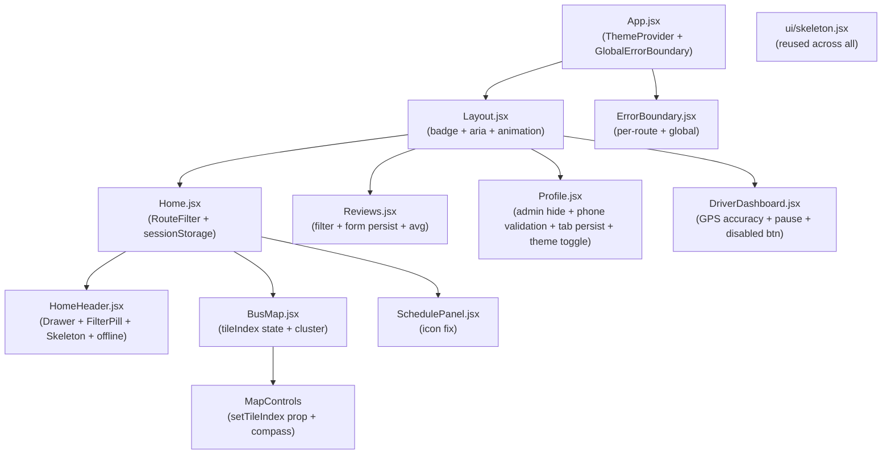

# Design Document: UI/UX Improvements — Karta-AD

## Overview

Данный документ описывает техническое решение для комплексного улучшения UI/UX приложения **Karta-AD** — транспортного веб-приложения для Таджикистана. Фича охватывает 11 требований, затрагивающих компоненты HomeHeader, BusMap, SchedulePanel, Reviews, Profile, DriverDashboard, Layout, а также общесистемные улучшения (Dark Mode, Skeleton Loaders, Error Boundaries, Tailwind-рефакторинг).

### Цель

Привести приложение к состоянию, когда:
- мобильные пользователи удобно взаимодействуют с фильтрами через bottom-sheet Drawer;
- карта корректно переключает слои и показывает кластеры;
- все компоненты поддерживают тёмную тему через CSS-переменные Tailwind;
- ошибки рендеринга изолированы ErrorBoundary на уровне маршрутов;
- пользователи видят Skeleton вместо пустых областей при загрузке;
- стилизация унифицирована через Tailwind CSS классы.

### Стек

- **React 18** + **Vite 6** — основа приложения
- **Tailwind CSS 3** + **tailwindcss-animate** — стилизация
- **Radix UI** (dialog, select, drawer) — доступные UI-примитивы
- **vaul** — Drawer / bottom-sheet для мобильных фильтров
- **Leaflet** + **react-leaflet** — карта
- **react-leaflet-cluster** — кластеризация маркеров на карте
- **next-themes** — управление тёмной/светлой темой
- **framer-motion** — анимации навигации
- **sonner** — уведомления
- **lucide-react** — иконки

---

## Architecture

### Общая структура изменений



### Потоки данных

1. **ThemeProvider** оборачивает весь `App`, предоставляя тему через `useTheme()` хук всем компонентам.
2. **tileIndex** хранится в `BusMap` через `useState` и передаётся в `MapControls` через props.
3. **RouteFilter** сохраняется в `sessionStorage` через кастомный хук `useSessionFilter` в `Home.jsx`.
4. **notificationCount** передаётся из `Home` → `Layout` через React Context (`NotificationContext`).
5. **ErrorBoundary** оборачивает каждый `<Route>` в `AuthenticatedApp` отдельно, плюс глобальный — вокруг `AuthenticatedApp`.

---

## Components and Interfaces

### 1. HomeHeader — мобильный Drawer и FilterPill

**Проблема:** Нативные `<select>` неудобны на мобильных, нет активного состояния у pill, нет сохранения фильтров.

**Решение:**
- Компонент `FilterPill` получает проп `active: boolean` и `onClear: () => void`.
- На экранах `< 640px` (`sm:hidden` / `block sm:hidden`) вместо `<select>` открывается `<Drawer>` из `vaul`.
- На экранах `≥ 640px` рендерится Radix UI `<Select>`.
- `useSessionFilter` хук сохраняет/восстанавливает `{ country, cityId, type, routeId }` в `sessionStorage['home_filters']`.

```tsx
// Интерфейс FilterPill
interface FilterPillProps {
  icon: ReactNode;
  label: string;
  value: string | null;
  active: boolean;
  onClear: () => void;
  onClick: () => void;    // открывает Drawer на мобильном
}

// Хук sessionStorage фильтров
function useSessionFilter(key: string, initial: T): [T, (val: T) => void]
```

**Offline баннер:** компонент `OfflineBanner` рендерится условно при `isOffline === true` (уже есть в `Home.jsx`, переносим в `HomeHeader` как проп).

**Skeleton состояние:** пока `isLoadingCities === true` — рендерятся 3 `<Skeleton className="h-9 w-24 rounded-2xl" />` вместо FilterPill-ов.

### 2. BusMap — tileIndex state и кластеризация

**Проблема:** `tileIndex` хранился внутри `MapControls`, но `TileLayer` рендерится в `BusMap` с хардкоженным URL. `MapControls` не получал `tileIndex`/`setTileIndex` пропсами.

**Решение:**
- `tileIndex` поднят в `BusMap` через `useState(0)`.
- `MapControls` получает `{ tileIndex, setTileIndex }` как пропсы.
- `TileLayer` использует `url={TILE_LAYERS[tileIndex].url}` — реактивный.
- Кнопка компаса вызывает `map.setBearing(angle)` (через leaflet-rotate plugin или `map.getContainer().style.transform`).

```tsx
// BusMap props (добавляется)
// Внутреннее состояние:
const [tileIndex, setTileIndex] = useState(0);

// MapControls props
interface MapControlsProps {
  tileIndex: number;
  setTileIndex: Dispatch<SetStateAction<number>>;
}
```

**Кластеризация:** используем `react-leaflet-cluster` (или `leaflet.markercluster`). Если маркеров > 15 — оборачиваем `<AnimatedVehicleMarker>` в `<MarkerClusterGroup>`.

```tsx
import MarkerClusterGroup from 'react-leaflet-cluster';

// Условная кластеризация
const shouldCluster = filteredVehicles.length > 15;

return shouldCluster ? (
  <MarkerClusterGroup chunkedLoading>
    {vehicleMarkers}
  </MarkerClusterGroup>
) : vehicleMarkers;
```

### 3. SchedulePanel — исправление иконок

**Проблема:** Инвертированная логика — `expanded ? ChevronDown : ChevronUp` показывает неправильную иконку.

**Исправление (одна строка):**
```tsx
// Было:
{expanded ? <ChevronDown /> : <ChevronUp />}

// Стало:
{expanded ? <ChevronUp /> : <ChevronDown />}
```

### 4. Reviews — фильтр, персистентность формы, avg

**Добавления:**
- `filterRouteId: string | null` — state для фильтра на вкладке `list`.
- Форма `ReviewForm` вынесена в отдельный компонент с локальным state, не сбрасывается при переключении вкладок (хранится в родителе `Reviews`).
- `routeAvgMap: Map<routeId, number>` — вычисляется из `reviews` и отображается в фильтре.

```tsx
// Функция вычисления средней оценки для маршрута
function calcAvg(reviews: Review[]): number {
  if (!reviews.length) return 0;
  const sum = reviews.reduce(
    (acc, r) => acc + ((r.cleanliness ?? 0) + (r.politeness ?? 0) + (r.punctuality ?? 0)) / 3,
    0
  );
  return sum / reviews.length;
}
```

### 5. Profile — безопасность, валидация телефона, tab persist

**Изменения:**
- Роль `admin` в кнопках рендерится только если `user?.role === 'admin'`, иначе рендерятся только `passenger` и `driver`.
- Если текущий пользователь — admin, кнопка `admin` disabled и не кликается.
- Regex для телефона: `^\+992\s?\d{2}\s?\d{3}\s?\d{4}$`.
- `profileTab` сохраняется/читается из `sessionStorage['profile_active_tab']`.
- Добавляется переключатель темы (Radix UI `<Switch>` или три кнопки `light/dark/system`).

```tsx
const PHONE_REGEX = /^\+992\s?\d{2}\s?\d{3}\s?\d{4}$/;

function validatePhone(phone: string): boolean {
  if (!phone) return true; // пустой телефон допустим
  return PHONE_REGEX.test(phone);
}
```

### 6. DriverDashboard — GPS accuracy, пауза, disabled кнопка

**Новые состояния:**
```tsx
const [isPaused, setIsPaused] = useState(false);
const [gpsAccuracy, setGpsAccuracy] = useState<number | null>(null);
```

**GPS accuracy indicator:**
```tsx
function GpsSignalBadge({ accuracy }: { accuracy: number | null }) {
  if (accuracy === null) return null;
  const color = accuracy <= 20 ? 'bg-green-500'
               : accuracy <= 50 ? 'bg-yellow-500'
               : 'bg-red-500';
  const label = accuracy <= 20 ? 'Хороший' : accuracy <= 50 ? 'Средний' : 'Слабый';
  return (
    <span className={`inline-flex items-center gap-1 text-xs text-white px-2 py-0.5 rounded-full ${color}`}>
      <span className="w-2 h-2 rounded-full bg-white/70" />
      {label} ({Math.round(accuracy)}м)
    </span>
  );
}
```

**Пауза:** при нажатии — `clearWatch`, `isPaused = true`, обновляем Vehicle `speed: 0`. При "Продолжить" — `watchPosition` возобновляется, `isPaused = false`.

**Disabled кнопка:** при `!selectedRoute` кнопка получает `opacity-40 bg-gray-400 cursor-not-allowed` и `title="Выберите маршрут для начала рейса"`.

### 7. Layout — badge и анимация

**NotificationContext:**
```tsx
// src/lib/NotificationContext.tsx
const NotificationContext = createContext<{ count: number }>({ count: 0 });
export const useNotificationCount = () => useContext(NotificationContext);
```

**Badge:**
```tsx
function NavBadge({ count }: { count: number }) {
  if (count === 0) return null;
  return (
    <span className="absolute -top-1 -right-1 bg-red-500 text-white text-[9px] font-bold
                     min-w-[16px] h-4 rounded-full flex items-center justify-center px-1">
      {count > 99 ? '99+' : count}
    </span>
  );
}
```

**Анимация:** Framer Motion `motion.div` с `whileTap={{ scale: 0.9 }}` и активный пункт получает `scale-110 transition-transform`.

**Accessibility:** активный `<Link>` получает `aria-current="page"`.

### 8. Dark Mode

**Подключение ThemeProvider в App.jsx:**
```tsx
import { ThemeProvider } from 'next-themes';

function App() {
  return (
    <ThemeProvider attribute="class" defaultTheme="system" enableSystem>
      <AuthProvider>
        {/* ... */}
      </AuthProvider>
    </ThemeProvider>
  );
}
```

**Переключатель в Profile:**
```tsx
import { useTheme } from 'next-themes';
const { theme, setTheme } = useTheme();
```

**Tailwind конфиг:** `darkMode: 'class'` в `tailwind.config.js`.

Все компоненты получают `dark:` варианты для основных цветов фона, текста и бордеров:
- `bg-white dark:bg-gray-900`
- `text-gray-800 dark:text-gray-100`
- `border-gray-100 dark:border-gray-700`

### 9. Skeleton Loaders

Используем существующий `src/components/ui/skeleton.jsx`.

| Компонент | Когда | Что показывается |
|---|---|---|
| HomeHeader | `isLoadingCities` | 3× `<Skeleton className="h-9 w-24 rounded-2xl" />` |
| ReviewsPage | `isLoadingReviews` | 3× `<Skeleton className="h-28 w-full rounded-2xl" />` |
| ProfilePage | `!user` | Skeleton аватара + 4 поля формы |
| DriverDashboard | `isLoadingRoutes` | 2× `<Skeleton className="h-12 w-full rounded-xl" />` |

### 10. Error Boundaries

**Компонент ErrorBoundary:**
```tsx
// src/components/ErrorBoundary.jsx
class ErrorBoundary extends Component {
  state = { hasError: false, error: null };

  static getDerivedStateFromError(error) {
    return { hasError: true, error };
  }

  componentDidCatch(error, info) {
    if (import.meta.env.DEV) {
      console.error('[ErrorBoundary]', error.message, info.componentStack);
    }
  }

  render() {
    if (this.state.hasError) {
      return this.props.fallback
        ? this.props.fallback(this.state.error)
        : <DefaultErrorFallback error={this.state.error} onReset={() => window.location.reload()} />;
    }
    return this.props.children;
  }
}
```

**Обёртка маршрутов в App.jsx:**
```tsx
<Route path="/" element={
  <ErrorBoundary>
    <Home />
  </ErrorBoundary>
} />
```

**BusMap fallback:** статичный `<div>` с координатами и сообщением об ошибке карты.

### 11. Tailwind рефакторинг

Принципы замены inline-стилей:

| Было (inline) | Стало (Tailwind) |
|---|---|
| `style={{ boxShadow: '0 -1px 0 #e5e7eb...' }}` | `shadow-[0_-1px_0_#e5e7eb] shadow-md` |
| `style={{ background: 'linear-gradient(...)' }}` | `bg-gradient-to-br from-blue-900 to-blue-600` |
| `style={{ paddingBottom: 'env(safe-area-inset-bottom, 8px)' }}` | `pb-safe` (через `tailwindcss-safe-area`) |
| `style={{ fontSize: 11, fontWeight: 400 }}` | `text-[11px] font-normal` |
| `style={{ minHeight: 0, width: '100%' }}` | `min-h-0 w-full` |
| `style={{ height: '100dvh' }}` | `h-dvh` |

Исключения: `route.color` (динамические runtime-значения) остаются как `style={{ background: route.color }}`.

---

## Data Models

### RouteFilter (sessionStorage)

```ts
interface RouteFilter {
  country: string;       // ISO/name страны
  cityId: string | null; // id города
  type: 'all' | 'bus' | 'minibus';
  routeId: string | null;
}
// Key: 'home_filters'
```

### ProfileTabState (sessionStorage)

```ts
type ProfileTab = 'settings' | 'favorites' | 'history';
// Key: 'profile_active_tab'
// Value: ProfileTab
```

### TripSession (runtime state в DriverDashboard)

```ts
interface TripSession {
  isTracking: boolean;
  isPaused: boolean;
  vehicleId: string | null;
  watchId: number | null;
  gpsInfo: {
    speed: number;
    lat: number;
    lng: number;
    accuracy: number | null;
  };
}
```

### NotificationContext

```ts
interface NotificationContextValue {
  count: number;
  notifications: Notification[];
  clear: () => void;
}
```

### ErrorBoundaryState

```ts
interface ErrorBoundaryState {
  hasError: boolean;
  error: Error | null;
}
```

### FilterPillProps

```ts
interface FilterPillProps {
  icon: ReactNode;
  label: string;
  value: string | null;
  active: boolean;
  onClear: () => void;
  onClick: () => void;
  loading?: boolean;
}
```

---

## Correctness Properties

*A property is a characteristic or behavior that should hold true across all valid executions of a system — essentially, a formal statement about what the system should do. Properties serve as the bridge between human-readable specifications and machine-verifiable correctness guarantees.*

### Property 1: FilterPill активное состояние содержит правильные CSS-классы

*For any* non-null filter value переданного в `FilterPill`, компонент SHALL содержать CSS-классы активного состояния (`bg-blue-600`, `text-white`) и отображать кнопку сброса (×).

**Validates: Requirements 1.2, 1.3**

---

### Property 2: Сохранение фильтров в sessionStorage (round-trip)

*For any* комбинации значений `RouteFilter` (country, cityId, type, routeId), после записи в `sessionStorage['home_filters']` и последующего чтения SHALL возвращаться идентичный объект.

**Validates: Requirements 1.4**

---

### Property 3: TileLayer реагирует на tileIndex

*For any* значения `tileIndex` в диапазоне `[0, TILE_LAYERS.length - 1]`, `TileLayer` SHALL использовать `url === TILE_LAYERS[tileIndex].url` — не хардкоженную строку.

**Validates: Requirements 2.1, 2.2, 2.3**

---

### Property 4: Кластеризация при превышении порога маркеров

*For any* массива транспортных средств с количеством > 15, `BusMap` SHALL использовать слой кластеризации (`MarkerClusterGroup`), а не отдельные маркеры.

**Validates: Requirements 2.5**

---

### Property 5: Корректные иконки SchedulePanel

*For any* маршрута с расписанием, при `expanded === false` SHALL отображаться `ChevronDown`, а при `expanded === true` SHALL отображаться `ChevronUp`.

**Validates: Requirements 3.1, 3.2, 3.3**

---

### Property 6: Форма Reviews не сбрасывается при смене вкладок

*For any* набора значений формы (`route_id`, `cleanliness`, `politeness`, `punctuality`, `comment`), после переключения со вкладки `write` на `list` и обратно, все значения формы SHALL оставаться неизменными.

**Validates: Requirements 4.3**

---

### Property 7: Вычисление средней оценки по маршруту

*For any* непустого списка отзывов для маршрута, отображаемое значение средней оценки SHALL равняться арифметическому среднему по (cleanliness + politeness + punctuality) / 3 для каждого отзыва.

**Validates: Requirements 4.5**

---

### Property 8: Скрытие роли admin для не-администраторов

*For any* пользователя, у которого `role !== 'admin'`, в ProfilePage SHALL отсутствовать DOM-элемент кнопки выбора роли `admin`.

**Validates: Requirements 5.1**

---

### Property 9: Валидация телефонного номера

*For any* строки телефона, соответствующей regex `^\+992\s?\d{2}\s?\d{3}\s?\d{4}$`, валидация SHALL пройти успешно (кнопка сохранения активна). *For any* строки, не соответствующей regex (и непустой), валидация SHALL вернуть ошибку и заблокировать отправку.

**Validates: Requirements 5.3, 5.4**

---

### Property 10: Персистентность активной вкладки Profile в sessionStorage

*For any* значения tab из `['settings', 'favorites', 'history']`, после установки активной вкладки `sessionStorage['profile_active_tab']` SHALL содержать это же значение.

**Validates: Requirements 5.5**

---

### Property 11: GPS-индикатор точности по диапазонам

*For any* значения `accuracy` из `GeolocationCoordinates`: если `accuracy ≤ 20` — SHALL отображаться зелёный индикатор; если `20 < accuracy ≤ 50` — жёлтый; если `accuracy > 50` — красный.

**Validates: Requirements 6.1**

---

### Property 12: Кнопка старта рейса disabled без маршрута

*For any* состояния `DriverDashboard`, где `selectedRoute === ''` (маршрут не выбран), кнопка "Начать рейс" SHALL иметь атрибут `disabled` и CSS-класс пониженной непрозрачности.

**Validates: Requirements 6.5**

---

### Property 13: Badge уведомлений

*For any* значения `notificationCount > 0`, badge SHALL быть видимым и содержать число `min(count, 99)` (или строку `"99+"` при `count > 99`). При `count === 0` badge SHALL отсутствовать в DOM.

**Validates: Requirements 7.1, 7.2, 7.3**

---

### Property 14: aria-current для активного навигационного пункта

*For any* активного пути маршрута, соответствующий элемент навигации в Layout SHALL иметь атрибут `aria-current="page"`, остальные элементы SHALL не иметь этого атрибута.

**Validates: Requirements 7.5**

---

### Property 15: Тема сохраняется в localStorage (round-trip)

*For any* значения темы из `['light', 'dark', 'system']`, после переключения через `useTheme().setTheme`, `localStorage['theme']` SHALL содержать это значение.

**Validates: Requirements 8.4**

---

### Property 16: Skeleton на вкладке Reviews при загрузке

*For any* состояния загрузки ReviewsPage (`isLoadingReviews === true`), в DOM SHALL присутствовать минимум 3 skeleton-элемента.

**Validates: Requirements 9.2**

---

### Property 17: ErrorBoundary перехватывает ошибки и показывает fallback

*For any* необработанной ошибки, выброшенной компонентом внутри `ErrorBoundary`, SHALL отображаться fallback-UI с сообщением об ошибке и кнопкой "Перезагрузить страницу". Основное приложение за пределами boundaries SHALL продолжать работать.

**Validates: Requirements 10.2**

---

## Error Handling

### Сетевые ошибки (HomeHeader, Reviews, DriverDashboard)

- При ошибке загрузки + непустом кэше: отображать данные из кэша + `OfflineBanner`.
- При ошибке загрузки + пустом кэше: отображать `InlineError` компонент с кнопкой "Повторить".
- Стратегия: `try/catch` в `useEffect`, `isError` state.

```tsx
const [isError, setIsError] = useState(false);

// В catch блоке:
const cached = loadCache(key);
if (cached) { setData(cached); setIsOffline(true); }
else { setIsError(true); }
```

### Ошибки геолокации (DriverDashboard)

- `PERMISSION_DENIED` → показать сообщение с инструкцией по настройке браузера.
- `POSITION_UNAVAILABLE` → показать "GPS недоступен, попробуйте позже".
- `TIMEOUT` → автоматически повторить через 10 сек.

```tsx
const handleGeoError = (err: GeolocationPositionError) => {
  if (err.code === 1) toast.error('Разрешите доступ к геолокации в настройках браузера');
  else if (err.code === 2) toast.error('GPS сигнал недоступен');
  else toast.error('Превышено время ожидания GPS');
};
```

### ErrorBoundary иерархия

```
GlobalErrorBoundary (обёртка AuthenticatedApp)
  └── PerRouteErrorBoundary (каждый Route в Layout)
       ├── Home → BusMapErrorBoundary (статичная заглушка карты)
       ├── Reviews
       ├── Profile
       ├── DriverDashboard
       ├── AdminPanel
       └── DriverSchedule
```

### Валидация телефона (Profile)

- Inline error под полем телефона.
- Кнопка "Сохранить" блокируется если `phoneError !== null`.
- Ошибка очищается при изменении поля.

---

## Testing Strategy

### Подход к тестированию

Используется двойная стратегия:
1. **Unit/Example тесты** — конкретные сценарии, состояния, edge cases.
2. **Property-based тесты** — универсальные свойства, проверяемые на сотнях случайных входов.

### Библиотеки

- **Vitest** — тест-раннер (уже в стеке через Vite)
- **@testing-library/react** — рендеринг компонентов
- **fast-check** — property-based тестирование (генераторы произвольных входов)

### Property-Based тесты

Каждый property тест запускается минимум **100 итераций** через fast-check.
Формат тега: `// Feature: ui-ux-improvements, Property N: <краткое описание>`

Список PBT по Properties из раздела Correctness Properties:

| Property | Тест | fast-check арбитрары |
|---|---|---|
| P1 FilterPill active state | `fc.string({ minLength: 1 })` → render с active=true → check classes | `fc.string()` |
| P2 SessionStorage round-trip | `fc.record({ country, cityId, type, routeId })` | `fc.record` |
| P3 TileLayer tileIndex | `fc.integer({ min: 0, max: 2 })` → check TileLayer url | `fc.integer` |
| P4 Кластеризация > 15 | `fc.array(vehicleArb, { minLength: 16 })` → check MarkerClusterGroup | custom arb |
| P5 SchedulePanel иконки | `fc.boolean()` → expanded → check icon | `fc.boolean()` |
| P6 Reviews форма persist | `fc.record(formArb)` → switch tabs → check values | `fc.record` |
| P7 Средняя оценка | `fc.array(reviewArb, { minLength: 1 })` → check avg | custom arb |
| P8 Admin role hidden | user с `role !== 'admin'` → check no admin button | enum arb |
| P9 Phone validation | valid/invalid strings → check validation result | `fc.string` + regex |
| P10 ProfileTab sessionStorage | tab values → check sessionStorage | `fc.constantFrom` |
| P11 GPS accuracy colors | `fc.float({ min: 0, max: 200 })` → check badge color | `fc.float` |
| P12 Disabled start button | state без маршрута → check disabled attr | state arb |
| P13 Badge count | `fc.integer({ min: 0, max: 150 })` → check badge | `fc.integer` |
| P14 aria-current | route paths → check aria-current | path arb |
| P15 Theme localStorage | theme values → check localStorage | `fc.constantFrom` |
| P16 Skeleton count | loading state → count skeletons ≥ 3 | — |
| P17 ErrorBoundary fallback | thrown errors → check fallback UI | error arb |

### Example/Integration тесты

- `HomeHeader` offline баннер при `navigator.onLine = false`
- `HomeHeader` inline error при пустом кэше + ошибке fetch
- `BusMap` компас вызывает `map.setBearing`
- `BusMap` клик на кластер разворачивает маркеры
- `Layout` рендерит метку "Отзывы" для `/reviews`
- `DriverDashboard` кнопка Пауза/Продолжить меняет состояние
- `Profile` admin кнопка disabled при `user.role === 'admin'`
- `App` ThemeProvider с `defaultTheme="system"` монтируется без ошибок
- Skeleton-заглушки рендерятся в загрузочных состояниях (все компоненты)
- ErrorBoundary логирует `error.message` и `componentStack` в DEV

### Smoke тесты

- App монтируется с ThemeProvider (Requirement 8.1)
- Все маршруты обёрнуты в ErrorBoundary (Requirement 10.1, 10.5)

### Coverage цели

- Утилитарные функции (`calcAvg`, `validatePhone`, `getGpsColor`) — 100%
- Компоненты (критичные пути) — > 80%
- Property тесты — 100 итераций минимум на каждый
